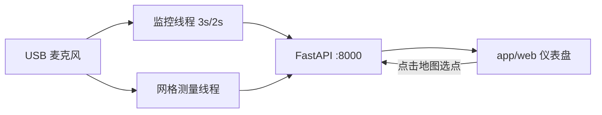

# 工程计划

## 目标

用树莓派 5 做一套"看得见、能量化"的开放式 ANC 硬件 Demo：

1. 摄像头对房间做空间建模，定位 3D 打印机（ArUco 标记 → 房间坐标）。
2. 先测量确认噪声大小与来源（SPL、频谱、噪声地图、来源归属），给出"是否需要降噪"建议。
3. 参考麦克风 + 误差麦克风 + 扬声器组成 ANC 主环，量化降噪效果（A/B、dB 差、A 加权）。
4. 预留迭代场景：空调、硬件工程师风枪、风机、门外扫地机器人。

## 决策记录（2026-08-05）

- 平台：Raspberry Pi 5，Python 3.11。
- 实时 ANC：树莓派直跑 I2S 音频（WM8960 编解码器 HAT，2 ADC + 2 DAC，ALSA 低延迟）。
- 空间建模：摄像头为主（ArUco + 平面检测）；LiDAR / 麦克风阵列 / ToF 作为 M3+ 迭代可选。
- 测量优先：M1 完全离线可跑（合成数据即可验证），不依赖实时硬件。

## 硬件清单

### 已有（待确认型号后回填）

| 部件 | 型号 | 备注 |
|---|---|---|
| 树莓派 5 | — | 复用吉他 demo 机器 |
| USB 麦克风 | — | M1 测量 |
| 摄像头 | — | USB 或 CSI，M3 空间建模 |
| 扬声器 | — | 有源音箱 |

### 需购买

| 部件 | 推荐型号 | 数量 | 价格参考 | 用途 |
|---|---|---|---|---|
| I2S 编解码器 HAT | WM8960（如 Waveshare/SG 系） | 1 | ¥60–120 | ANC 实时环路：参考麦 ADC、误差麦 ADC、DAC 输出 |
| 音频功放/音箱线材 | — | 1 | — | DAC 线路输出 → 有源音箱 |
| ArUco 标记 | A4 打印 | 1 | 打印 | 打印机定位 |

> WM8960 两路 ADC 正好承接参考麦克风与误差麦克风，一路 DAC 输出反相声波，是
> Pi 直跑低延迟 ANC 最简洁的方案。备选：INMP441 ×2（I2S 麦克风）+ PCM5102 DAC 板。

### 迭代可选

| 元器件 | 型号 | 价格参考 | 作用 |
|---|---|---|---|
| 2D LiDAR | RPLIDAR A1 / LD19 | ¥200–700 | 房间 2D 地图，不依赖光照 |
| 麦克风阵列 | ReSpeaker 4-Mic USB | ¥100–200 | 声源 DOA 估计 |
| ToF 传感器 | VL53L1X | ¥20–40 | 近距离补充测距 |

## 软件架构

```
app/
├── capture.py      音频采集（sounddevice / arecord 兜底），统一录音接口，内存录音 record_buffer
├── monitor.py      实时监控线程：周期采样 → SPL/频谱/来源/Pi 状态（供仪表盘轮询）
├── grid.py         后台网格测量任务：网格录音 → 分析 → 插值 surface → 建议静音区
├── analyze.py      SPL / 频谱 / 音调峰值 / A 加权 / 音调占比
├── source_id.py    频谱峰值 → 噪声源归属（匹配 Profile）
├── noise_map.py    网格测量 → 2D 噪声地图（插值 + 导出）
├── room_model.py   空间建模：相机平面 / LiDAR 2D 地图，房间坐标系
├── position.py     ArUco 标记检测 → 打印机 6DoF 位姿 → 房间坐标
├── quiet_zone.py   静音区选择与可行性检查（安静区尺寸、延迟预算）
├── evaluate.py     ANC 前后 A/B 评估：总 dB、音调 dB、A 加权、频谱差
├── main.py         FastAPI Web UI / API（:8000），挂载 app/web 静态仪表盘
├── web/            仪表盘前端（原生 HTML/JS/CSS，无构建步骤）
├── anc/
│   ├── fxlms.py    Filtered-x LMS 自适应滤波
│   ├── harmonic.py 周期噪声谐波消除（自适应陷波 / PLL 基频跟踪）
│   ├── live.py     实时引擎：block 级谐波消除 + 双工流线程（自参考，无需参考麦）
│   └── pipeline.py ANC 控制器：状态机 + 参数 + 报告
├── synth.py        合成 3D 打印机噪声（步进音调 + 风扇宽带），离线自测
data/
├── recordings/     测量录音
├── reports/        分析报告 JSON
└── profiles/       噪声源 Profile（5 个场景）
scripts/
├── measure.py      CLI：网格录音 → 分析 → 报告
├── calibrate-mic.py CLI：麦克风灵敏度标定
├── run-anc.py      CLI：ANC 环路（实时或模拟）
└── run_anc_live.py CLI：现场实时 ANC（--list / --synthetic / 设备选择 / A/B 报告）
```

## 关键技术点

### 延迟预算（Pi 直跑 I2S）

- 宽带 ANC：总延迟需 ≤ ~1 ms，标准 USB 音频（20–60 ms）不可行。
- 音调 ANC：噪声可预测，FXLMS 收敛相位后 3–10 ms 延迟即可降。
- 实现：ALSA 直连、小 period、禁用 PipeWire 重采样；实时循环用 `sched` 高优先级线程。

### 安静区几何

静音点 = 误差麦克风位置。系统给出"预期安静区直径"（主降噪频率的 λ/10），
用户在地图上选点后，检查该点相对打印机距离与延迟预算，判断是否值得降噪。

### 噪声源 Profile（M4 迭代）

每个场景一个 JSON：预期频谱签名、参考麦克风建议位置、ANC 可行性、特殊注意点。

## 里程碑 M1.5 — Web 仪表盘

在 M1 与 M2 之间插入的一个可演示里程碑：让 demo"看得见"，展示三件事——
实时噪声大小、树莓派是否在工作、建模后建议静音区放哪。

### API

| 端点 | 方法 | 说明 |
|---|---|---|
| `/` | GET | 静态仪表盘（`app/web/`） |
| `/api/live` | GET | 实时噪声快照 + Pi 状态（监控线程每 3s 采样 2s） |
| `/api/grid/measure` | POST | 启动后台网格测量 `{origin, size, step, per_point_s, synthetic}` |
| `/api/grid/status` | GET | 任务进度 + 结果（测点、插值 surface、来源、建议静音区） |
| `/api/quiet-zone` | POST | 点选静音区 `{x, y, source_x, source_y}` → 可行性检查 |
| `/health` `/api/status` `/api/report` | GET | 保留既有端点 |

### 交互流



网格测量运行时自动暂停实时监控（`monitor.set_paused`），避免抢占音频设备。

### 验收（M1.5）

- [ ] 仪表盘在浏览器打开，实时 SPL / 频谱 / 来源 / Pi 状态每 3s 刷新。
- [ ] 配置网格（范围/步长/每点时长）后一键测量，进度条实时更新。
- [ ] 测量完成后显示噪声地图热力图 + 建议静音区圆（直径 = 安静区直径）。
- [ ] 点选地图任意点，返回距离 / 传播延迟 / 安静区直径 / 可行性结论。
- [ ] `ANC_SYNTHETIC=1` 时无硬件即可跑通全部流程（本机自测）。
- [ ] 系统在 Pi 上以 systemd 服务自启（`anc-demo.service` 不变，端口 8000）。

## 里程碑 M2 — 实时 ANC Demo

已实现。核心：**自参考谐波消除**——无需参考麦克风 / I2S 编解码器，单支误差麦 +
一个音频输出即可现场演示，正合"快速验证 demo"的目标。对步进电机、风扇叶片、
压缩机等稳态周期噪声有效（M1 测量的 3D 打印机属此类）。

### 为什么不需要参考麦（相比原计划）

- 谐波消除器直接从**误差信号**估计基频并跟踪各谐波幅度/相位（`app/anc/harmonic.py`），
  是自参考的，不需要额外参考麦。
- FXLMS 前馈需要参考麦，离线模拟已实现（`app/anc/fxlms.py`），等 WM8960 到位后
  通过 `LiveANCEngine` 扩展为参考+误差两路即可。

### 实现

| 文件 | 说明 |
|---|---|
| `app/anc/live.py` | `BlockHarmonicCanceller`（向量化 block NLMS）+ `LiveANCEngine`（双工流线程，A/B 分段采集） |
| `scripts/run_anc_live.py` | 现场 CLI：`--list` / `--synthetic` / `--in-device` / `--out-device` / `--f0` / `--gain` / `--baseline` |
| `app/main.py` | `/api/anc/live/start|stop|status|report`、`/api/audio/devices` |
| `app/web/` | ANC 卡片：状态 / 实时 SPL 曲线 / 降噪量 / A/B 报告 |

### API

| 端点 | 方法 | 说明 |
|---|---|---|
| `/api/anc/live/start` | POST | `{synthetic, in_device, out_device, f0, gain, baseline_s, duration_s}` |
| `/api/anc/live/stop` | POST | 停止并返回最终状态 |
| `/api/anc/live/status` | GET | 状态 / 相位（baseline→cancelling→done）/ SPL / 降噪量 |
| `/api/anc/live/report` | GET | 完成后 A/B 报告（宽带 / A 加权 / 音调峰值降低） |
| `/api/audio/devices` | GET | 列出输入/输出设备，供前端下拉选择 |

### 现场操作指引（Pi）

1. `python scripts/run_anc_live.py --list` 确认输入（USB 麦）与输出设备名称。
2. 噪声源保持运行（打印机打印中 / 风扇运转）；麦克风放在"想要安静的点"。
3. 扬声器接 Pi 音频输出（3.5mm/HDMI 或 USB 音箱），音量从小调起。
4. `--baseline 5 --duration 60`，输出增益默认 0.4；若啸叫/不收敛则降低 `--gain`。
5. 仪表盘 ANC 卡片同流程：选设备 → 开始 ANC → 看实时 SPL 下降与 A/B 报告。

### 合成模式自测

`python scripts/run_anc_live.py --synthetic --baseline 3 --duration 15`：基线估计
f0≈120 Hz，谐波峰值降 ~14–17 dB，宽带总降噪 ~7 dB（本机已验证）。

### 验收（M2）

- [x] 实时谐波消除引擎收敛：纯谐波稳态降噪 ≥ 12 dB，打印机噪声 ≥ 4 dB（`tests/test_live.py`）。
- [x] 合成模式全流程跑通（基线→估计 f0→实时消除→A/B 报告）。
- [ ] 现场真机：误差麦处 ANC on vs off 音调成分 dB 差 ≥ 10 dB 视为 Demo 成功。
- [ ] 现场排查项：设备选择（`--list`）、输出增益（啸叫）、基频自动估计失败时 `--f0` 手动指定。

## 验收

- [ ] M1：在真实 3D 打印机房间完成网格测量，输出噪声地图 + 来源归属报告。
- [ ] M1.5：仪表盘运行，实时噪声 + Pi 状态 + 交互式静音区建议可用（见上）。
- [ ] M2：误差麦克风处 ANC 开启 vs 关闭 dB 差（音调成分 ≥ 10 dB 视为 Demo 成功）。
- [ ] M3：摄像头定位打印机坐标误差 < 30 cm；打印状态检测准确。
- [ ] M4：至少一个非打印机场景跑通测量 → 来源归属 → ANC 评估。
